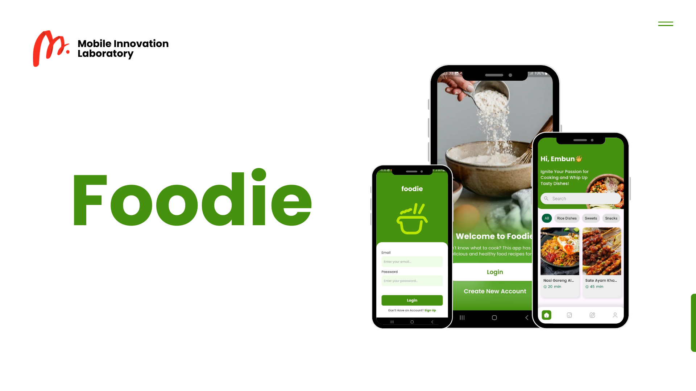
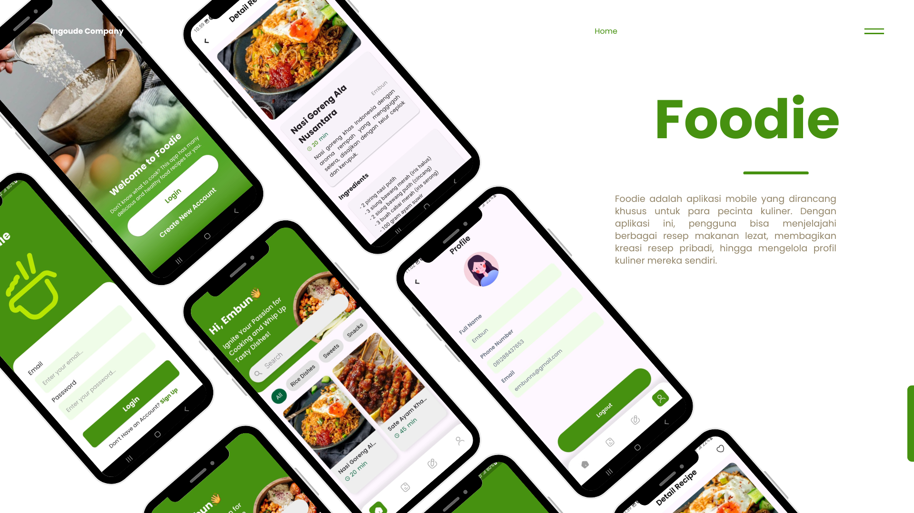

# Foodie 🍽️

## Deskripsi
**Foodie** adalah aplikasi mobile yang dirancang khusus untuk para pecinta kuliner. Dengan aplikasi ini, pengguna bisa menjelajahi berbagai resep makanan lezat hingga membagikan kreasi resep pribadi
**Foodie** bukan sekadar aplikasi resep, tapi juga komunitas berbagi inspirasi di dapur! ✨

---

## Fitur Unggulan 🚀
| Fitur | Deskripsi |
|---|---|
| 🔐 Login & Signup | Akses aplikasi dengan akun pribadi |
| 📖 Jelajah Resep | Lihat dan cari resep makanan yang lengkap dengan detailnya |
| 🔎 Filtering Resep | Temukan resep favoritmu berdasarkan kategori atau bahan |
| 📤 Upload Resep | Bagikan resep andalan ke komunitas Foodie |
| ✏️ Edit Resep | Perbarui resep yang sudah diunggah |
| 🗑️ Hapus Resep | Hapus resep yang tidak ingin ditampilkan lagi |
| 👤 Profil Pengguna | Kelola profil lengkap dengan daftar resep milikmu |

---

## Cara Penggunaan 💡
1. Clone repository ini ke komputer atau laptop kamu.
2. Buka folder proyek menggunakan code editor seperti VSCode.
3. Jalankan aplikasi menggunakan emulator atau device langsung.
4. Login atau daftar akun baru.
5. Jelajahi berbagai resep yang ada atau langsung unggah resep kreasi kamu.
6. Kelola resep di halaman profil sesuai kebutuhan.

--
